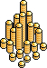

# coinpiles

Generate a gold coin pile image from a number.

## Quick start

```bash
pip install coinpiles
coinpiles generate --coins 145 --output out.png
```

## Python API

```python
from coinpiles import generate_image, save_png

img = generate_image(coins=145)
img.save("out.png")

img2 = generate_image(coins=80, random_seed=42, pile_spacing=5.0)

save_png("out.png", coins=80)
```

`generate_image(...)` accepts:

| argument | default | description |
|---|---|---|
| `coins` | required | number of coins to render |
| `width` | `512` | canvas width in pixels before crop |
| `height` | `512` | canvas height in pixels before crop |
| `random_seed` | `42` | seed for deterministic layout |
| `pile_spacing` | `5.0` | distance between pile anchor points; lower = denser |
| `new_pile_probability` | `0.1` | chance of starting a new pile at each growth step |
| `position_weight_multiplier` | `2.0` | bias toward placing coins in higher pile positions |
| `height_weight_multiplier` | `-1.0` | bias against already tall piles to spread growth |

## CLI usage

```bash
coinpiles generate --coins 80 --pile-spacing 4.8 --random-seed 42 --output out.png
```

## Custom sprite images

You can provide your own sprite files by path (`top`, `layer_even`, `layer_odd`, `bottom`).

Python API:

```python
from coinpiles import save_png

save_png(
    "out_custom.png",
    coins=80,
    top_path="my_assets/top.png",
    layer_even_path="my_assets/layer_even.png",
    layer_odd_path="my_assets/layer_odd.png",
    bottom_path="my_assets/bottom.png",
)
```

CLI:

```bash
coinpiles generate --coins 80 --top-path "my_assets/top.png" --layer-even-path "my_assets/layer_even.png" --layer-odd-path "my_assets/layer_odd.png" --bottom-path "my_assets/bottom.png" --output out_custom_paths.png
```

## Example output



## Determinism

Rendering is deterministic by default. `coinpiles` uses a fixed RNG seed, so the same input produces the same image output.

## Assets

Coin sprites in `coinpiles/coinpiles/assets/` are original artwork created by the project author and are licensed under the same MIT license as this project.
